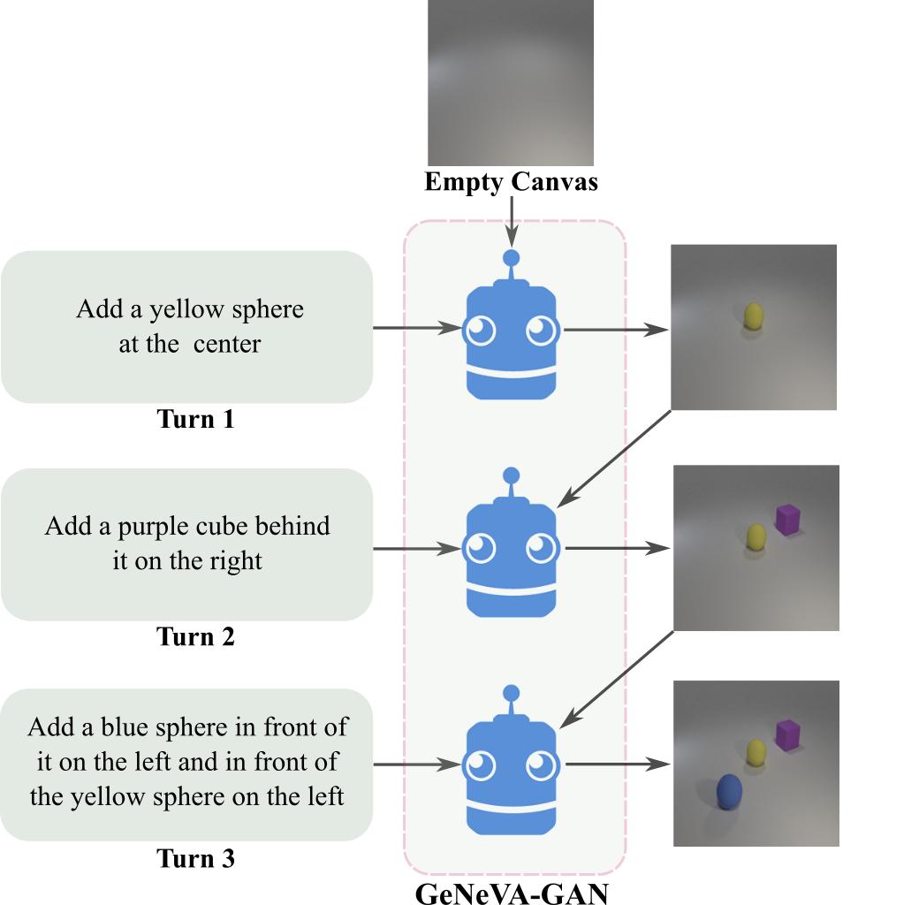
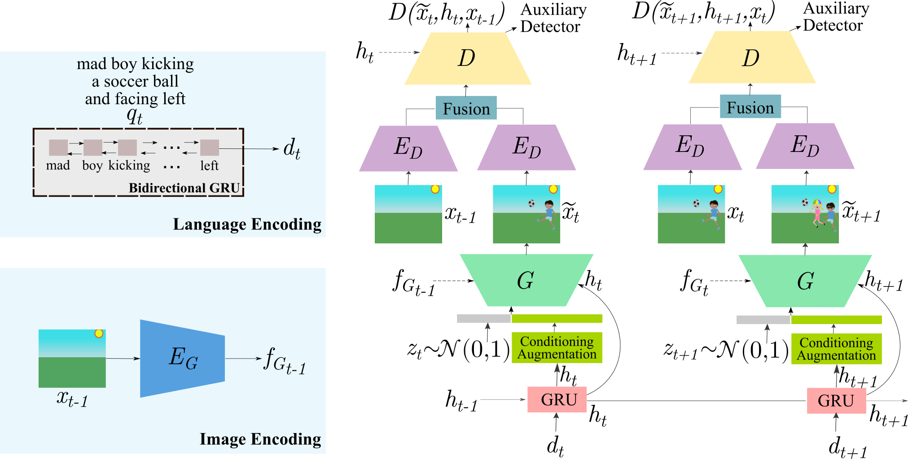
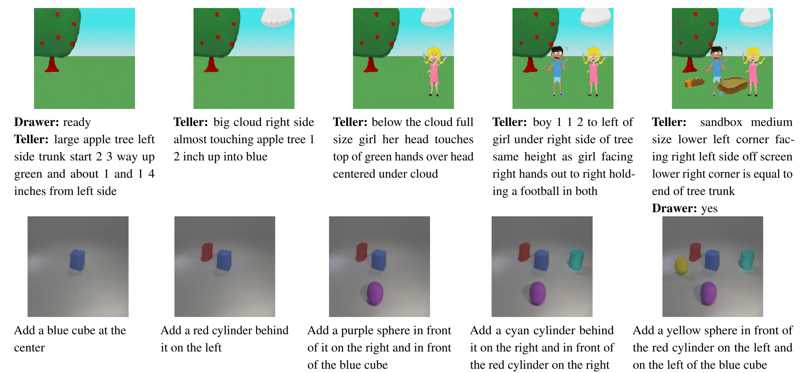

# Generative Neural Visual Artist (GeNeVA): GeNeVA-GAN Training Code

Code to train and evaluate the GeNeVA-GAN model for the GeNeVA task proposed in our ICCV 2019 paper [Tell, Draw, and Repeat: Generating and Modifying Images Based on Continual Linguistic Instruction](https://arxiv.org/abs/1811.09845).

| | |
:-------------------------:|:-------------------------:
| GeNeVA Task              | GeNeVA-GAN

|  |
:--------------------------------------------------------------------------------------------:|
| Example images generated by GeNeVA-GAN on CoDraw (top row) and i-CLEVR (bottom row); shown with the provided instructions |

## Setup ##

All the models in the paper were trained and tested on 2 NVIDIA P100 GPUs.

### 1. Generate `data` folder for CoDraw and i-CLEVR datasets

See [GeNeVA - Datasets - Generation Code](https://github.com/Maluuba/GeNeVA_datasets/)

### 2. Install Miniconda

    wget https://repo.continuum.io/miniconda/Miniconda3-latest-Linux-x86_64.sh
    bash Miniconda3-latest-Linux-x86_64.sh
    rm Miniconda3-latest-Linux-x86_64.sh

### 3. Create a conda environment for this repository

    conda env create -f environment.yml

### 4. Activate the environment

    source activate geneva  # or `conda activate geneva` for newer conda installs

### 5. Run setup

    python setup.py install

### 6. Run visdom

    visdom

Training progress for all the experiments can be tracked in visdom which by default starts at `http://localhost:8097/`.

## Training the object detector and localizer ##

    python scripts/train_object_detector_localizer.py --num-classes=24 --train-hdf5=../GeNeVA_datasets/data/iCLEVR/clevr_obj_train.h5 --valid-hdf5=../GeNeVA_datasets/data/iCLEVR/clevr_obj_val.h5 --cuda-enabled  # for i-CLEVR
    python scripts/train_object_detector_localizer.py --num-classes=58 --train-hdf5=../GeNeVA_datasets/data/CoDraw/codraw_obj_train.h5 --valid-hdf5=../GeNeVA_datasets/data/CoDraw/codraw_obj_val.h5 --cuda-enabled  # for CoDraw

Note: The above commands also have several options, which can be found in the python script, that need to be set. Batch size (`--batch-size`) is not per-GPU but combined across GPUs.

This trains the object detector and localizer model used for evaluating GeNeVA-GAN on Precision, Recall, F1-Score, and `rsim` metrics. For comparison with results in our paper, you should skip training the model yourself and download the pre-trained models (`iclevr_inception_best_checkpoint.pth` and `codraw_inception_best_checkpoint.pth`) from the [GeNeVA Project Page](https://www.microsoft.com/en-us/research/project/generative-neural-visual-artist-geneva/).

## Training on CoDraw ##

Modify `geneva/config.yml` and `example_args/codraw-d-subtract.args` if needed and run:

    python geneva/inference/train.py @example_args/codraw-d-subtract.args

## Training on i-CLEVR ##

Modify `geneva/config.yml` and `example_args/iclevr-d-subtract.args` if needed and run:

    python geneva/inference/train.py @example_args/iclevr-d-subtract.args

## Evaluating a trained model on CoDraw test set ##

You will have to add the line `--load_snapshot=</path/to/trained/model>` to `example_args/codraw-d-subtract.args` to specify the checkpoint to load from and then run:

    python geneva/inference/test.py @example_args/codraw-d-subtract.args

## Evaluating a trained model on i-CLEVR test set ##

You will have to add the line `--load_snapshot=</path/to/trained/model>` to `example_args/iclevr-d-subtract.args` to specify the checkpoint to load from and then run:

    python geneva/inference/test.py @example_args/iclevr-d-subtract.args

## Reference ##
If you use this code or the GeNeVA datasets as part of any published research, please cite the following paper:

Alaaeldin El-Nouby, Shikhar Sharma, Hannes Schulz, Devon Hjelm, Layla El Asri, Samira Ebrahimi Kahou, Yoshua Bengio, and Graham W. Taylor.
**"Tell, Draw, and Repeat: Generating and Modifying Images Based on Continual Linguistic Instruction"**.
*Proceedings of the IEEE International Conference on Computer Vision (ICCV)*. 2019.

```bibtex
@InProceedings{El-Nouby_2019_ICCV,
    author    = {El{-}Nouby, Alaaeldin and Sharma, Shikhar and Schulz, Hannes and Hjelm, Devon and El Asri, Layla and Ebrahimi Kahou, Samira and Bengio, Yoshua and Taylor, Graham W.},
    title     = {Tell, Draw, and Repeat: Generating and Modifying Images Based on Continual Linguistic Instruction},
    booktitle = {The IEEE International Conference on Computer Vision (ICCV)},
    month     = {Oct},
    year      = {2019}
}
```

## Microsoft Open Source Code of Conduct ##
This project welcomes contributions and suggestions. Most contributions require you to
agree to a Contributor License Agreement (CLA) declaring that you have the right to,
and actually do, grant us the rights to use your contribution. For details, visit
https://cla.microsoft.com.

When you submit a pull request, a CLA-bot will automatically determine whether you need
to provide a CLA and decorate the PR appropriately (e.g., label, comment). Simply follow the
instructions provided by the bot. You will only need to do this once across all repositories using our CLA.

This project has adopted the [Microsoft Open Source Code of Conduct](https://opensource.microsoft.com/codeofconduct/).
For more information see the [Code of Conduct FAQ](https://opensource.microsoft.com/codeofconduct/faq/)
or contact [opencode@microsoft.com](mailto:opencode@microsoft.com) with any additional questions or comments.

## License ##
See [LICENSE.txt](LICENSE.txt). For Third Party Notices, see [NOTICE.txt](NOTICE.txt).
